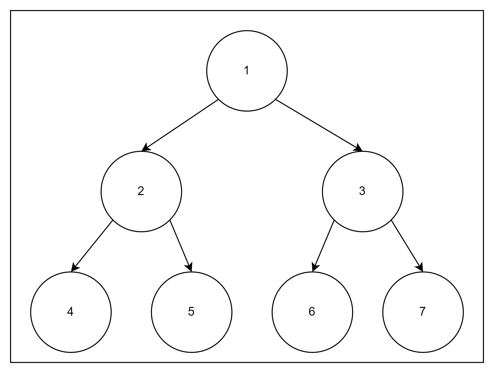

1) Create a binary tree from the following nested array:
- ```var array = [1, [[2, [[4, [null, null]], [5, [null, null]]]], [3, [[6, [null, null]], [7, [null, null]]]]]]```
- ```func makeTree(array) -> TreeNode?```


2) Print the value of the nodes form left to right/top to bottom.
- ```func printBreathFirst(TreeNode)```
- It should print out in this order: ```1, 2, 3, 4, 5, 6, 7```


3) Build a new binary tree and print breath first with the following array:
- ```[1, [[2, [[3, [null, null]], [4, [null, null]]]], [5, [[6, [null, null]], [7, [null, null]]]]]]```
- - It should print out in this order: ```1, 2, 5, 3, 4, 6, 7```
